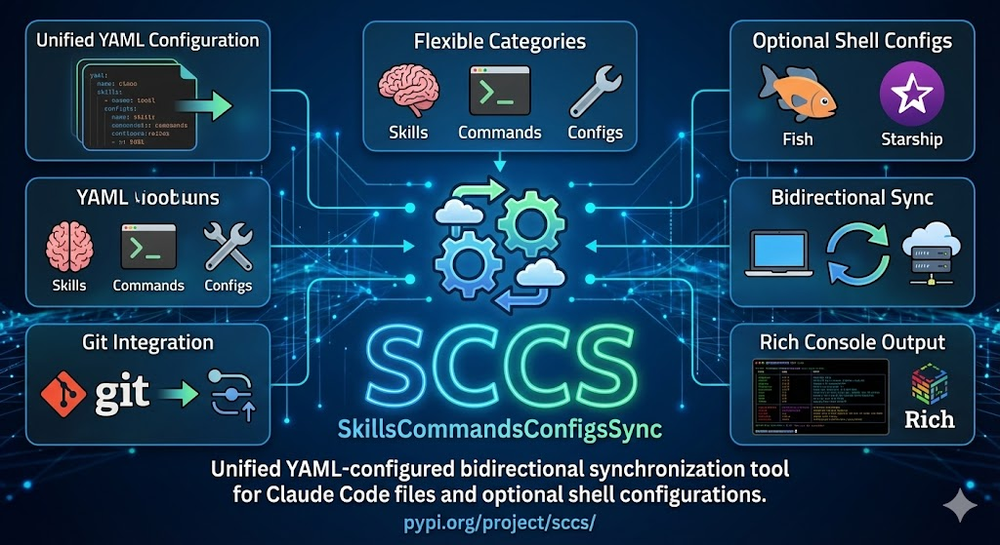

# SCCS - SkillsCommandsConfigsSync



Unified YAML-configured bidirectional synchronization tool for Claude Code files and optional shell configurations.

## Features

- **Unified YAML Configuration**: Single `config.yaml` with all sync categories
- **Flexible Categories**: Sync Claude skills, commands, hooks, scripts, and more
- **Optional Shell Configs**: Fish shell, Starship prompt, and custom configs
- **Bidirectional Sync**: Full two-way synchronization with conflict detection
- **Interactive Conflict Resolution**: Menu-driven conflict handling with `-i` flag
- **Automatic Backups**: Creates timestamped backups before overwriting files
- **Git Integration**: Auto-commit and push after sync operations
- **Rich Console Output**: Beautiful terminal output with Rich
- **Path Transformation**: Machine-independent configuration files

## Installation

```bash
pip install sccs
```

Or with UV (recommended):

```bash
uv pip install sccs
```

For development:

```bash
git clone https://github.com/equitania/sccs.git
cd sccs
uv venv && source .venv/bin/activate
uv pip install -e ".[dev]"
```

## Quick Start

```bash
# Initialize configuration
sccs config init

# Show sync status
sccs status

# Preview changes
sccs sync --dry-run

# Synchronize all enabled categories
sccs sync

# Sync specific category
sccs sync --category claude_skills
```

## Configuration

Configuration is stored in `~/.config/sccs/config.yaml`:

```yaml
# Repository settings
repository:
  path: ~/gitbase/sccs-sync
  remote: origin
  auto_commit: false
  auto_push: false
  commit_prefix: "[SYNC]"

# Sync categories
sync_categories:
  claude_framework:
    enabled: true
    description: "SuperClaude Framework files"
    local_path: ~/.claude
    repo_path: .claude/framework
    sync_mode: bidirectional
    item_type: file
    include:
      - "CLAUDE.md"
      - "PERSONAS.md"
      # ... more files

  claude_skills:
    enabled: true
    local_path: ~/.claude/skills
    repo_path: .claude/skills
    sync_mode: bidirectional
    item_type: directory
    item_marker: SKILL.md

  fish_config:
    enabled: true
    local_path: ~/.config/fish
    repo_path: .config/fish
    sync_mode: bidirectional
    item_type: mixed
    include:
      - "config.fish"
      - "functions/*.fish"
    exclude:
      - "fish_history"
      - "*.local.fish"
```

## Configuration Reference

The complete structure of `~/.config/sccs/config.yaml`:

```yaml
# ═══════════════════════════════════════════════════════════════
# SCCS Configuration File
# ═══════════════════════════════════════════════════════════════

# ─────────────────────────────────────────────────────────────────
# Repository Settings
# ─────────────────────────────────────────────────────────────────
repository:
  path: ~/gitbase/sccs-sync      # Local repository path
  remote: origin                  # Git remote name for push
  auto_commit: false              # Auto-commit after sync
  auto_push: false                # Auto-push after commit
  commit_prefix: "[SYNC]"         # Prefix for commit messages

# ─────────────────────────────────────────────────────────────────
# Sync Categories
# Each category defines what to sync and how
# ─────────────────────────────────────────────────────────────────
sync_categories:

  # Example: Claude Skills (directories with marker file)
  claude_skills:
    enabled: true                 # Enable/disable this category
    description: "Claude Code Skills"
    local_path: ~/.claude/skills  # Source path (supports ~)
    repo_path: .claude/skills     # Destination in repository
    sync_mode: bidirectional      # bidirectional | local_to_repo | repo_to_local
    item_type: directory          # file | directory | mixed
    item_marker: SKILL.md         # Marker file for directory items
    include:                      # Glob patterns to include
      - "*"
    exclude:                      # Glob patterns to exclude
      - "_archive/*"
      - "*.tmp"

  # Example: Claude Commands (single files)
  claude_commands:
    enabled: true
    description: "Claude Code Commands"
    local_path: ~/.claude/commands
    repo_path: .claude/commands
    sync_mode: bidirectional
    item_type: file
    item_pattern: "*.md"          # File pattern for file items
    include:
      - "*"
    exclude:
      - "_*.md"                   # Private commands
      - "*.local.md"              # Local overrides

  # Example: Fish Shell (mixed files and directories)
  fish_config:
    enabled: true
    description: "Fish Shell Configuration"
    local_path: ~/.config/fish
    repo_path: .config/fish
    sync_mode: bidirectional
    item_type: mixed              # Both files and directories
    include:
      - "config.fish"
      - "functions/*.fish"
      - "conf.d/*.fish"
    exclude:
      - "fish_history"            # Never sync history
      - "fish_variables"          # Machine-specific
      - "*.local.fish"            # Local overrides

# ─────────────────────────────────────────────────────────────────
# Global Excludes (apply to all categories)
# ─────────────────────────────────────────────────────────────────
global_exclude:
  - ".DS_Store"
  - "*.swp"
  - "*~"
  - ".git"
  - "__pycache__"
  - "*.pyc"
  - ".env"
  - "*.local"
  - "*.local.*"

# ─────────────────────────────────────────────────────────────────
# Conflict Resolution
# ─────────────────────────────────────────────────────────────────
conflict_resolution:
  default: prompt                 # prompt | local | repo | newest
  per_category:
    claude_framework: repo        # Framework always from repo
    fish_config: local            # Local fish config wins

# ─────────────────────────────────────────────────────────────────
# Path Transformations (for machine-independent configs)
# ─────────────────────────────────────────────────────────────────
path_transforms:
  placeholders:
    HOME: "{{HOME}}"
    USER: "{{USER}}"
    HOSTNAME: "{{HOSTNAME}}"
  transform_files:
    - pattern: "settings.template.json"
      source: "settings.json"

# ─────────────────────────────────────────────────────────────────
# Output Settings
# ─────────────────────────────────────────────────────────────────
output:
  verbose: false
  colored: true
  log_file: ~/.config/sccs/sync.log
  sync_history: ~/.config/sccs/history.yaml
```

### Category Field Reference

| Field | Type | Required | Description |
|-------|------|----------|-------------|
| `enabled` | bool | No | Enable/disable category (default: true) |
| `description` | string | No | Human-readable description |
| `local_path` | string | **Yes** | Local source path (supports `~`) |
| `repo_path` | string | **Yes** | Path in repository |
| `sync_mode` | string | No | `bidirectional`, `local_to_repo`, `repo_to_local` |
| `item_type` | string | No | `file`, `directory`, `mixed` (default: file) |
| `item_marker` | string | No | Marker file for directory items (e.g., `SKILL.md`) |
| `item_pattern` | string | No | Glob pattern for file items (e.g., `*.md`) |
| `include` | list | No | Patterns to include (default: `["*"]`) |
| `exclude` | list | No | Patterns to exclude (default: `[]`) |
| `platforms` | list | No | Platform filter: `["macos"]`, `["linux"]`, `null` = all |

## CLI Commands

### Main Commands

```bash
# Synchronize files
sccs sync                    # Sync all enabled categories
sccs sync --category skills  # Sync specific category
sccs sync --dry-run          # Preview without changes
sccs sync -i                 # Interactive conflict resolution
sccs sync --force local      # Force local version in conflicts
sccs sync --force repo       # Force repo version in conflicts

# Git operations (override config settings)
sccs sync --commit           # Commit changes (overrides auto_commit=false)
sccs sync --push             # Push after commit (overrides auto_push=false)
sccs sync --commit --push    # Sync, commit and push
sccs sync --no-commit        # Skip commit (overrides auto_commit=true)
sccs sync --no-push          # Skip push (overrides auto_push=true)

# Status and diff
sccs status                  # Show status of all categories
sccs status --category fish  # Status of specific category
sccs diff                    # Show all diffs in all categories
sccs diff -c claude_skills   # Show all diffs in category
sccs diff my-skill -c claude_skills  # Show diff for specific item

# History
sccs log                     # Show sync history
sccs log --last 20           # Show last 20 entries
```

### Configuration Commands

```bash
sccs config show             # Show current configuration
sccs config init             # Create new configuration
sccs config init --force     # Overwrite existing config
sccs config edit             # Open config in editor
sccs config validate         # Validate configuration
```

### Category Management

```bash
sccs categories              # List all categories (alias: list)
sccs categories --all        # Include disabled categories
sccs categories enable fish  # Enable a category
sccs categories disable fish # Disable a category
```

## Sync Categories

### Claude Code Categories (enabled by default)

| Category | Path | Description |
|----------|------|-------------|
| `claude_framework` | `~/.claude/*.md` | SuperClaude Framework files |
| `claude_skills` | `~/.claude/skills/` | Skills (directories with SKILL.md) |
| `claude_commands` | `~/.claude/commands/` | Commands (single .md files) |
| `claude_hooks` | `~/.claude/hooks/` | Event handler scripts |
| `claude_scripts` | `~/.claude/scripts/` | Utility scripts |
| `claude_plugins` | `~/.claude/plugins/` | Plugin configurations |
| `claude_mcp` | `~/.claude/mcp/` | MCP server configs |
| `claude_statusline` | `~/.claude/statusline.*` | Statusline script |

### Shell Categories (enabled by default)

| Category | Path | Platform | Description |
|----------|------|----------|-------------|
| `fish_config` | `~/.config/fish/` | all | Fish shell configuration |
| `fish_config_macos` | `~/.config/fish/conf.d/*.macos.fish` | macOS | macOS-specific conf.d |
| `fish_functions` | `~/.config/fish/functions/` | all | Fish custom functions |
| `fish_functions_macos` | `~/.config/fish/functions/macos/` | macOS | macOS-specific functions |
| `starship_config` | `~/.config/starship.toml` | all | Starship prompt |

### Synced Skills

All 19 skills synchronized as directories with `SKILL.md` marker:

| Skill | Description |
|-------|-------------|
| `astro` | Astro.js v5 development |
| `claude-workbench` | Rust TUI project |
| `eq-chatbot-core` | Python LLM library |
| `fastreport-api` | ASP.NET Core report API |
| `fastreport-odoo` | FastReport YAML for Odoo |
| `it-guy-content` | it-guy.ai website content |
| `myodoo-docker` | Server infrastructure |
| `odoo-common` | Central Odoo config |
| `odoo-mcp` | MCP-Odoo integration |
| `odoo-website-themes` | Odoo website themes |
| `odoo16` | Odoo v16 development |
| `odoo18` | Odoo v18 development |
| `odoo19` | Odoo v19 development |
| `ownerp-demodata` | Odoo demo data generator |
| `project-docs` | Bilingual documentation |
| `project-tips` | Fish shell quick reference |
| `sccs` | SCCS project itself |
| `v18-chatbot` | Odoo 18 chatbot module |
| `vscode-server` | Docker VSCode Server |

### Synced Fish Files

**Fish Functions (cross-platform)**:
`backup`, `bass`, `dclean`, `dlogs`, `docker-platform`, `docker-platforms`, `dstop`, `extract`, `fisher`, `gadd`, `gchg`, `gfix`, `gps`, `mkcd`, `nvm`, `tips`, `uvclean`, `uvpublish`, `uvsetup`

**Fish Functions (macOS only)** — `fish_functions_macos`:
`odoo-db`, `odoo-debug`, `odoo-env`, `odoo-install`, `odoo-logs`, `odoo-run`, `odoo-scaffold`, `odoo-shell`, `odoo-start`, `odoo-stop`, `odoo-test`, `odoo-update`, `odoo16`, `odoo17`, `odoo18`, `odoo19`

**Fish conf.d (macOS only)** — `fish_config_macos`:
`10-path.macos.fish`, `30-aliases-system.macos.fish`, `35-aliases-tools.macos.fish`, `36-aliases-odoo.macos.fish`

### Optional Categories (disabled by default)

| Category | Path | Description |
|----------|------|-------------|
| `claude_plans` | `~/.claude/plans/` | Session plans |
| `claude_todos` | `~/.claude/todos/` | Persistent TODO lists |
| `git_config` | `~/.gitconfig` | Git configuration |
| `project_templates` | Custom | Project templates |

## Platform-Awareness

SCCS supports platform-specific categories that only sync on matching operating systems.

### How it works

- The `platforms` field in a category config accepts a list: `["macos"]`, `["linux"]`, or `["macos", "linux"]`
- Platform detection uses `platform.system()`: `Darwin` maps to `macos`, `Linux` maps to `linux`
- Categories with `platforms: null` (default) sync on **all** platforms
- Categories with `platforms: ["macos"]` are **skipped** on Linux and vice versa

### Example

```yaml
fish_config_macos:
  enabled: true
  platforms: ["macos"]          # Only syncs on macOS
  local_path: ~/.config/fish/conf.d
  repo_path: .config/fish/conf.d
  item_pattern: "*.macos.fish"
```

This allows the same repository to serve both macOS and Linux machines — platform-specific files are stored in the repo but only synchronized on the matching OS.

## Sync Modes

Each category can use one of three sync modes:

- **bidirectional**: Changes flow both ways (default)
- **local_to_repo**: Only push local changes to repository
- **repo_to_local**: Only pull repository changes locally

## Item Types

Categories can contain different item types:

- **file**: Individual files (e.g., `*.md`, `config.fish`)
- **directory**: Directories with marker file (e.g., skills with `SKILL.md`)
- **mixed**: Both files and directories

## Conflict Resolution

When both local and repo have changes, SCCS offers multiple resolution strategies:

### Interactive Mode (Recommended)

Use `-i` flag for menu-driven conflict resolution:

```bash
sccs sync -i
```

The interactive menu offers:
1. **Keep local** - Use local version, overwrite repo
2. **Keep repo** - Use repo version, overwrite local
3. **Show diff** - View differences before deciding
4. **Skip** - Skip this item, continue with others
5. **Abort** - Stop sync completely

### Automatic Resolution

Configure default resolution in `config.yaml`:

```yaml
conflict_resolution:
  default: prompt              # prompt | local | repo | newest
  per_category:
    claude_framework: repo     # Framework always from repo
    fish_config: local         # Local fish config wins
```

Or use force flags:
```bash
sccs sync --force local   # Local wins all conflicts
sccs sync --force repo    # Repository wins all conflicts
```

## Automatic Backups

Before overwriting any file, SCCS creates a timestamped backup:

```
~/.config/sccs/backups/
├── claude_skills/
│   └── my-skill.20250123_143052.bak
├── fish_config/
│   └── config.fish.20250123_143052.bak
└── ...
```

Backups are organized by category and include timestamps for easy recovery.

## Directory Structure

### Local

```
~/.claude/
├── CLAUDE.md, PERSONAS.md, ...  # Framework files
├── skills/
│   └── my-skill/
│       └── SKILL.md
├── commands/
│   └── my-command.md
├── hooks/
├── scripts/
└── mcp/

~/.config/
├── fish/
│   ├── config.fish
│   └── functions/
└── starship.toml
```

### Repository

```
repo/
├── .claude/
│   ├── framework/    # Framework files
│   ├── skills/       # Skills
│   ├── commands/     # Commands
│   └── ...
└── .config/
    ├── fish/         # Fish config
    └── starship.toml # Starship config
```

## Development

```bash
# Run tests
pytest

# Run with coverage
pytest --cov=sccs

# Format code
black sccs/ tests/
isort sccs/ tests/

# Type checking
mypy sccs/
```

## License

AGPL-3.0 - Equitania Software GmbH
