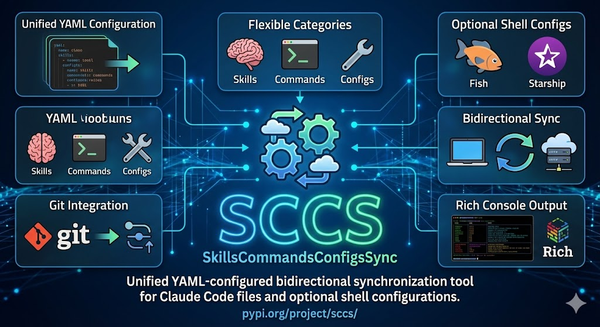

# SCCS - SkillsCommandsConfigsSync



> **Language / Sprache**: [Deutsch](#deutsche-dokumentation) | [English](#english-documentation)

---

## Deutsche Dokumentation

### Projektübersicht

SCCS ist ein YAML-konfiguriertes bidirektionales Synchronisierungswerkzeug für Claude Code Dateien und optionale Shell-Konfigurationen. Es hält Skills, Commands, Hooks, Scripts und Shell-Configs zwischen einer lokalen Installation und einem Git-Repository synchron.

**Version:** 2.16.0 · **Lizenz:** AGPL-3.0 · **Python:** ≥3.10

### Funktionen

- **YAML-Konfiguration** — Zentrale `config.yaml` mit allen Sync-Kategorien
- **Flexible Kategorien** — Claude Skills, Commands, Hooks, Scripts, Fish-Shell u.v.m.
- **Bidirektionale Synchronisierung** — Zweiwege-Sync mit Konflikterkennung
- **Interaktive Konflikterkennung** — Menügesteuerte Konfliktauflösung mit `-i`
- **Automatische Backups** — Zeitgestempelte Sicherungen vor Überschreiben
- **Git-Integration** — Auto-Commit und Push nach Synchronisierung
- **Plattform-Filter** — Kategorien nur auf macOS, Linux oder beidem synchronisieren
- **Smart Conflict Resolution** — `--force newer` löst Konflikte per Dateizeit (mtime)
- **Project Memories Sync** — Claude's persistente Projekt-Memories synchronisieren
- **Selektiver Export/Import** — ZIP-Archive mit Checkbox-Auswahl fuer Kundendeployments
- **Rich-Ausgabe** — Formatierte Terminal-Ausgabe mit Rich
- **Memory Bridge** — Persistenter Kontext zwischen Claude Code und Claude.ai via Git-Sync
- **Memory-CLI** — Vollständige CRUD-Verwaltung mit `sccs memory`
- **Auto-Expire** — Zeitgesteuerte Archivierung abgelaufener Memory-Items

### Voraussetzungen

[UV](https://docs.astral.sh/uv/) muss installiert sein:

| Betriebssystem | Befehl |
|----------------|--------|
| macOS | `brew install uv` |
| Linux / WSL | `curl -LsSf https://astral.sh/uv/install.sh \| sh` |
| Windows | `powershell -ExecutionPolicy ByPass -c "irm https://astral.sh/uv/install.ps1 \| iex"` |

### Installation

**Als CLI-Tool (empfohlen):**

```bash
uv tool install sccs
```

**Aktualisierung:**

```bash
uv tool upgrade sccs
```

**UV aktualisieren:**

```bash
# macOS
brew upgrade uv

# Linux / Windows
uv self update
```

### Für Entwickler

```bash
git clone https://github.com/equitania/sccs.git
cd sccs
uv venv --python 3.13 && source .venv/bin/activate
uv pip install -e ".[dev]"
sccs --help
```

### Workflows

#### Publisher (Änderungen teilen)

```bash
sccs sync --commit --push      # Synchronisieren, committen und pushen
sccs sync --dry-run             # Vorschau der Änderungen
sccs sync -c skills --push      # Nur Skills pushen
```

#### Subscriber (Änderungen empfangen)

```bash
sccs sync --pull                # Aktuelle Version ziehen und lokal synchronisieren
sccs sync --force repo          # Lokale Version mit Repo überschreiben
sccs sync -c skills --pull      # Nur Skills empfangen
```

### Schnellstart

```bash
# Konfiguration erstellen
sccs config init

# Status anzeigen
sccs status

# Änderungen prüfen
sccs sync --dry-run

# Alles synchronisieren
sccs sync

# Bestimmte Kategorie synchronisieren
sccs sync -c claude_skills
```

### Export/Import (Kundendeployment)

Konfigurationen selektiv als ZIP-Archiv exportieren und auf anderen Systemen importieren — ideal fuer Kundendeployments, bei denen nicht das gesamte Repository uebertragen werden soll.

#### Export

```bash
# Interaktive Auswahl per Checkbox
sccs export

# Alles exportieren (ohne Auswahl)
sccs export --all

# Eigenen Ausgabepfad angeben
sccs export -o ~/Desktop/kunde-config.zip

# Nur bestimmte Kategorien
sccs export -c claude_skills
sccs export -c claude_skills -c claude_agents

# Kombiniert: Nur Skills, ohne Interaktion
sccs export -c claude_skills --all -o skills.zip
```

Die interaktive Auswahl zeigt alle verfuegbaren Items gruppiert nach Kategorie mit Checkboxen:

```
? Select items to export (42 available):
  ── Claude Code Skills ──
  [✔] code-review
  [✔] git-workflow
  [ ] internal-tool
  ── Claude Agents ──
  [✔] code-reviewer
  ── Fish Shell (macos only) ──
  [✔] config.fish  (macos only)
```

#### Import

```bash
# Interaktive Auswahl, was importiert werden soll
sccs import config.zip

# Alles importieren
sccs import config.zip --all

# Vorschau ohne Schreiben
sccs import config.zip --dry-run

# Bestehende Dateien ueberschreiben (mit automatischem Backup)
sccs import config.zip --overwrite

# Ohne Backup ueberschreiben
sccs import config.zip --overwrite --no-backup
```

#### Einsatzbereiche

| Szenario | Empfohlener Befehl |
|----------|-------------------|
| Skills an Kunden liefern | `sccs export -c claude_skills -o kunde.zip` |
| Fish-Config fuer Linux-Server | `sccs export -c fish_config -c fish_functions --all` |
| Komplett-Setup fuer neues System | `sccs export --all -o full-setup.zip` |
| Vorschau vor dem Import | `sccs import setup.zip --dry-run` |
| Sicheres Update bestehender Configs | `sccs import setup.zip --overwrite` |

### Konfiguration

Konfigurationsdatei: `~/.config/sccs/config.yaml`

```yaml
# Repository-Einstellungen
repository:
  path: ~/gitbase/sccs-sync      # Lokaler Repository-Pfad
  remote: origin                  # Git Remote Name
  auto_commit: false              # Auto-Commit nach Sync
  auto_push: false                # Auto-Push nach Commit
  auto_pull: false                # Auto-Pull vor Sync
  commit_prefix: "[SYNC]"         # Prefix für Commit-Nachrichten

# Sync-Kategorien
sync_categories:
  claude_skills:
    enabled: true
    description: "Claude Code Skills"
    local_path: ~/.claude/skills
    repo_path: .claude/skills
    sync_mode: bidirectional       # bidirectional | local_to_repo | repo_to_local
    item_type: directory           # file | directory | mixed
    item_marker: SKILL.md          # Marker-Datei für Verzeichnisse
    include: ["*"]
    exclude: ["_archive/*"]

  fish_config:
    enabled: true
    platforms: ["macos"]           # Nur auf macOS synchronisieren
    local_path: ~/.config/fish
    repo_path: .config/fish
    item_type: mixed
    include: ["config.fish", "functions/*.fish"]
    exclude: ["fish_history", "fish_variables"]

# Globale Ausschlüsse
global_exclude:
  - ".DS_Store"
  - "*.tmp"
  - "__pycache__"
```

### Memory Bridge

#### Konzept

Claude Code (Terminal) und Claude.ai (Web) teilen keinen gemeinsamen Speicher. Der Memory Bridge löst dies file-basiert:

```
local: ~/.claude/memory/<slug>/MEMORY.md
↕ SCCS-Sync (bidirektional, via Git)
repo: .claude/memory/<slug>/MEMORY.md
→ Claude.ai:    sccs memory export  →  als <memory>...</memory> Block einfügen
→ Claude Code:  SessionStart-Hook lädt Memory automatisch als Context
```

#### Memory Item Format

Jedes Memory Item ist eine Datei `MEMORY.md` mit YAML-Frontmatter und Markdown-Body:

```markdown
---
id: "project-odoo18-arch"
title: "Odoo 18 Architecture Decisions"
category: decision   # project|decision|learning|pattern|preference|reference|context
project: v18
tags: [odoo, architecture]
priority: 4          # 1 (niedrig) – 5 (kritisch)
created: "2026-02-23T10:00:00"
updated: "2026-02-23T14:30:00"
expires: null        # ISO datetime oder null
version: 1
---

# Odoo 18 Architecture Decisions

Inhalt in Markdown.
```

#### Konfiguration

Zwei neue Blöcke in `~/.config/sccs/config.yaml`:

```yaml
# 1. Memory-Kategorie (standardmäßig deaktiviert)
sync_categories:
  claude_memory:
    enabled: false           # Explizit aktivieren: sccs categories enable claude_memory
    description: "Claude Code <-> Claude.ai Memory Bridge"
    local_path: ~/.claude/memory
    repo_path: .claude/memory
    sync_mode: bidirectional
    item_type: directory
    item_marker: MEMORY.md
    conflict_resolution: newest   # Neuestes updated-Timestamp gewinnt
    exclude: ["_archive/*", "*.tmp"]

# 2. Memory-Einstellungen
memory_config:
  auto_expire: false           # Abgelaufene Items bei sccs sync archivieren
  max_context_chars: 8000      # Maximale Zeichen für SessionStart-Hook
  min_priority: 1              # Mindest-Priorität für Hook-Export
  max_age_days: null           # Maximales Alter (Tage), null = unbegrenzt
```

#### Lokale Einrichtung

```bash
# 1. Kategorie aktivieren
sccs categories enable claude_memory

# 2. Hook installieren (wird mit sccs sync -c claude_hooks synchronisiert)
#    Alternativ: hook direkt unter ~/.claude/hooks/load-memory.py ablegen

# 3. Hook in ~/.claude/settings.json eintragen (manuell!)
```

```json
{
  "hooks": {
    "SessionStart": [
      {
        "hooks": [{"type": "command", "command": "python3 ~/.claude/hooks/load-memory.py"}]
      }
    ]
  }
}
```

```bash
# 4. Optional: Anthropic API für Cloud-Sync (Files API)
uv pip install "sccs[memory]"
export ANTHROPIC_API_KEY="..."

# 5. Ersten Sync durchführen
sccs sync -c claude_memory
```

> **Wichtig**: Das private Repository für Memory-Sync verwenden, da Memory-Items persönliche Entscheidungen und Kontextinformationen enthalten können.

#### Memory CLI-Befehle

```bash
# Memory-Items verwalten
sccs memory add "Titel" [--content "..."] [--from-stdin] [--from-file pfad] \
                        [--tag TAG] [--project P] [--priority 1-5] [--expires DATUM]
sccs memory list        [--project P] [--tag T] [--expired] [--min-priority N]
sccs memory show <slug> [--raw]
sccs memory edit <slug>
sccs memory update <slug> [--extend "..."] [--tag T] [--priority N] [--bump-version]
sccs memory delete <slug> [--force]   # Soft-Delete: verschiebt nach _archive/

# Suche und Export
sccs memory search "query" [--project P]
sccs memory export  [--format claude_block|markdown|json] \
                    [--project P] [--tag T] [--out DATEI] [--api]
sccs memory import conversation.json [--preview]

# Verwaltung
sccs memory expire        # Abgelaufene Items archivieren
sccs memory stats         # Statistiken anzeigen
```

#### Sync-Richtung und Konfliktauflösung

| Aspekt | Verhalten |
|--------|-----------|
| Sync-Modus | `bidirectional`: lokal ↔ Repository (Standard) |
| Konfliktauflösung | `conflict_resolution: newest`: Das Item mit dem neueren `updated`-Timestamp gewinnt automatisch |
| Soft-Delete | `sccs memory delete` verschiebt nach `_archive/<slug>/` — kein Datenverlust |
| Auto-Expire | Items mit vergangener `expires`-Zeit werden bei `sccs sync` archiviert wenn `auto_expire: true` |
| Prioritätsfilter | SessionStart-Hook respektiert `min_priority` aus `memory_config` |
| Zeichenlimit | Hook kürzt Context bei `max_context_chars` (Standard: 8000) |

#### Export-Workflows für Claude.ai

```bash
# Als <memory>...</memory> Block für System-Prompt in Claude.ai
sccs memory export
sccs memory export --project v18 --format claude_block

# Als JSON (strukturiert)
sccs memory export --format json --out ~/Desktop/memory.json

# Über Anthropic Files API hochladen (erfordert sccs[memory] + ANTHROPIC_API_KEY)
sccs memory export --api

# Claude.ai Konversations-Export importieren
sccs memory import ~/Downloads/conversation.json
sccs memory import ~/Downloads/conversation.json --preview  # Vorschau ohne Speichern
```

#### Sicherheitshinweise

- **Privates Repository**: `claude_memory` nur mit privatem Git-Repo nutzen
- **API-Key**: `ANTHROPIC_API_KEY` ausschließlich als Umgebungsvariable, nie in Dateien
- **Globale Ausschlüsse**: Bestehende `global_exclude`-Pattern schützen automatisch vor versehentlichem Sync sensibler Dateinamen (`*token*`, `*secret*`, `*credential*`)
- **`--api` ist immer explizit**: Anthropic Files API-Upload niemals automatisch

### Kategorien-Referenz

| Feld | Typ | Pflicht | Beschreibung |
|------|-----|---------|-------------|
| `enabled` | bool | Nein | Kategorie aktivieren (Standard: true) |
| `description` | string | Nein | Beschreibung |
| `local_path` | string | **Ja** | Lokaler Quellpfad (unterstützt `~`) |
| `repo_path` | string | **Ja** | Pfad im Repository |
| `sync_mode` | string | Nein | `bidirectional`, `local_to_repo`, `repo_to_local` |
| `item_type` | string | Nein | `file`, `directory`, `mixed` (Standard: file) |
| `item_marker` | string | Nein | Marker-Datei für Verzeichnisse (z.B. `SKILL.md`) |
| `item_pattern` | string | Nein | Glob-Pattern für Dateien (z.B. `*.md`) |
| `include` | list | Nein | Einschluss-Patterns (Standard: `["*"]`) |
| `exclude` | list | Nein | Ausschluss-Patterns (Standard: `[]`) |
| `platforms` | list | Nein | Plattform-Filter: `["macos"]`, `["linux"]`, `null` = alle |

### CLI-Befehle

```bash
# Synchronisierung
sccs sync                        # Alle aktivierten Kategorien
sccs sync -c skills              # Bestimmte Kategorie
sccs sync -n                     # Vorschau (Dry-Run)
sccs sync -i                     # Interaktive Konfliktauflösung
sccs sync --force local          # Lokale Version erzwingen
sccs sync --force repo           # Repo-Version erzwingen
sccs sync --force newer          # Neuere Datei erzwingen (mtime)
sccs sync --commit --push        # Mit Git-Commit und Push
sccs sync --pull                 # Vorher Remote-Änderungen ziehen

# Status und Diff
sccs status                      # Sync-Status aller Kategorien
sccs diff                        # Alle Unterschiede anzeigen
sccs diff -c skills              # Diffs einer Kategorie
sccs log                         # Sync-Verlauf

# Konfiguration
sccs config show                 # Konfiguration anzeigen
sccs config init                 # Neue Konfiguration erstellen
sccs config edit                 # Im Editor öffnen
sccs config validate             # Konfiguration prüfen

# Export/Import
sccs export                      # Interaktive Auswahl + ZIP erstellen
sccs export --all -o config.zip  # Alles exportieren
sccs export -c claude_skills     # Nur bestimmte Kategorie
sccs import config.zip           # Interaktive Auswahl + importieren
sccs import config.zip --dry-run # Vorschau ohne Schreiben
sccs import config.zip --all     # Alles importieren

# Kategorien
sccs categories list             # Aktivierte Kategorien
sccs categories list --all       # Alle (inkl. deaktivierte)
sccs categories enable fish      # Kategorie aktivieren
sccs categories disable fish     # Kategorie deaktivieren
```

### Standard-Kategorien

#### Claude Code (standardmäßig aktiv)

| Kategorie | Pfad | Beschreibung |
|-----------|------|-------------|
| `claude_framework` | `~/.claude/*.md` | SuperClaude Framework-Dateien |
| `claude_skills` | `~/.claude/skills/` | Skills (Verzeichnisse mit SKILL.md) |
| `claude_commands` | `~/.claude/commands/` | Commands (einzelne .md-Dateien) |
| `claude_hooks` | `~/.claude/hooks/` | Event-Handler-Skripte |
| `claude_agents` | `~/.claude/agents/` | Sub-Agent-Definitionen mit Modell-Routing |
| `claude_scripts` | `~/.claude/scripts/` | Hilfsskripte |
| `claude_plugins` | `~/.claude/plugins/` | Plugin-Konfigurationen |
| `claude_mcp` | `~/.claude/mcp/` | MCP-Server-Konfigurationen |
| `claude_statusline` | `~/.claude/statusline.*` | Statusline-Skript |

#### Claude Code (standardmäßig deaktiviert)

| Kategorie | Pfad | Beschreibung |
|-----------|------|-------------|
| `claude_memories` | `~/.claude/projects/*/memory/` | Persistente Projekt-Memories (feedback, project, user, reference) |
| `claude_memory` | `~/.claude/memory/` | Memory Bridge Items (claude_memory aktivieren) |
| `claude_settings` | `~/.claude/settings.json` | Claude Code Settings (Permissions, Hooks-Config) |

#### Shell (standardmäßig aktiv)

| Kategorie | Pfad | Plattform | Beschreibung |
|-----------|------|-----------|-------------|
| `fish_config` | `~/.config/fish/` | alle | Fish-Shell-Konfiguration |
| `fish_config_macos` | `~/.config/fish/conf.d/*.macos.fish` | macOS | macOS-spezifische conf.d |
| `fish_functions` | `~/.config/fish/functions/` | alle | Fish-Funktionen |
| `fish_functions_macos` | `~/.config/fish/functions/macos/` | macOS | macOS-spezifische Funktionen |
| `starship_config` | `~/.config/starship.toml` | alle | Starship-Prompt |

### Konfliktauflösung

Bei Änderungen auf beiden Seiten bietet SCCS mehrere Auflösungsstrategien:

**Interaktiver Modus** (empfohlen):

```bash
sccs sync -i
```

Optionen im interaktiven Menü:
1. **Lokal behalten** — Lokale Version verwenden
2. **Repo behalten** — Repository-Version verwenden
3. **Diff anzeigen** — Unterschiede prüfen
4. **Interaktives Merge** — Hunk-für-Hunk-Zusammenführung
5. **Externer Editor** — In Editor öffnen
6. **Überspringen** — Dieses Element auslassen
7. **Abbrechen** — Sync komplett abbrechen

**Automatische Auflösung**:

```bash
sccs sync --force local          # Lokal gewinnt immer
sccs sync --force repo           # Repository gewinnt immer
sccs sync --force newer          # Neuere Datei gewinnt (per mtime)
```

### Automatische Backups

Vor jedem Überschreiben erstellt SCCS zeitgestempelte Sicherungen:

```
~/.config/sccs/backups/
├── claude_skills/
│   └── my-skill.20250123_143052.bak
└── fish_config/
    └── config.fish.20250123_143052.bak
```

### Plattform-Awareness

Kategorien können auf bestimmte Betriebssysteme beschränkt werden:

```yaml
fish_config_macos:
  enabled: true
  platforms: ["macos"]              # Nur auf macOS synchronisieren
  local_path: ~/.config/fish/conf.d
  repo_path: .config/fish/conf.d
  item_pattern: "*.macos.fish"
```

Erkennung: `Darwin` → `macos`, `Linux` → `linux`. Kategorien mit `platforms: null` synchronisieren auf allen Plattformen.

### Architektur

```
sccs/
├── cli.py                # Click CLI mit Befehlsgruppen
├── cli_memory.py         # Memory Command Group
├── config/               # Konfigurationsmanagement
│   ├── schema.py         #   Pydantic-Modelle
│   ├── loader.py         #   YAML-Laden/Speichern
│   └── defaults.py       #   Standard-Konfiguration
├── sync/                 # Synchronisierungs-Engine
│   ├── engine.py         #   Hauptorchestrator
│   ├── category.py       #   Kategorie-Handler
│   ├── item.py           #   SyncItem, Scan-Funktionen
│   ├── actions.py        #   Aktionstypen und -ausführung
│   ├── state.py          #   State-Persistenz
│   └── settings.py       #   JSON-Settings-Ensure
├── transfer/             # Export/Import-Modul
│   ├── manifest.py       #   ZIP-Manifest (Pydantic)
│   ├── exporter.py       #   Scan + ZIP-Erstellung
│   ├── importer.py       #   ZIP-Extraktion + Platzierung
│   └── ui.py             #   questionary Checkbox-Helpers
├── git/                  # Git-Operationen
│   └── operations.py     #   Commit, Push, Pull, Status
├── memory/               # Memory Bridge Modul
│   ├── __init__.py       #   Modul-Exports
│   ├── item.py           #   MemoryItem (Frontmatter + Markdown)
│   ├── manager.py        #   CRUD-Layer für ~/.claude/memory/
│   ├── filter.py         #   Filter und Sortierung
│   ├── bridge.py         #   Import/Export Claude.ai
│   └── api.py            #   Optionaler Anthropic Files API Layer
├── output/               # Terminal-Ausgabe
│   ├── console.py        #   Rich-Console
│   ├── diff.py           #   Diff-Anzeige
│   └── merge.py          #   Interaktives Merge
└── utils/                # Hilfsfunktionen
    ├── paths.py          #   Pfad-Utilities, atomares Schreiben
    ├── hashing.py        #   SHA256-Hashing
    └── platform.py       #   Plattformerkennung
```

### Entwicklung

```bash
# Tests
pytest                            # Alle Tests
pytest --cov=sccs                 # Mit Coverage (Minimum: 60%)

# Code-Qualität
ruff check sccs/ tests/           # Linting
ruff format sccs/ tests/          # Formatierung
mypy sccs/                        # Typenprüfung
bandit -r sccs/                   # Security-Scan
```

### Lizenz

AGPL-3.0 — Equitania Software GmbH

---

## English Documentation

### Project Overview

SCCS is a YAML-configured bidirectional synchronization tool for Claude Code files and optional shell configurations. It keeps skills, commands, hooks, scripts, and shell configs in sync between a local installation and a Git repository.

**Version:** 2.16.0 · **License:** AGPL-3.0 · **Python:** ≥3.10

### Features

- **YAML Configuration** — Single `config.yaml` with all sync categories
- **Flexible Categories** — Claude skills, commands, hooks, scripts, Fish shell, and more
- **Bidirectional Sync** — Full two-way synchronization with conflict detection
- **Interactive Conflict Resolution** — Menu-driven conflict handling with `-i` flag
- **Automatic Backups** — Timestamped backups before overwriting files
- **Git Integration** — Auto-commit and push after sync operations
- **Platform Filtering** — Sync categories only on macOS, Linux, or both
- **Smart Conflict Resolution** — `--force newer` resolves conflicts by file modification time
- **Project Memories Sync** — Sync Claude's persistent project memories across machines
- **Selective Export/Import** — ZIP archives with checkbox selection for customer deployments
- **Rich Console Output** — Formatted terminal output with Rich
- **Memory Bridge** — Persistent context between Claude Code and Claude.ai via Git sync
- **Memory CLI** — Full CRUD management with `sccs memory`
- **Auto-Expire** — Time-based archiving of expired memory items

### Prerequisites

[UV](https://docs.astral.sh/uv/) must be installed:

| OS | Command |
|----|---------|
| macOS | `brew install uv` |
| Linux / WSL | `curl -LsSf https://astral.sh/uv/install.sh \| sh` |
| Windows | `powershell -ExecutionPolicy ByPass -c "irm https://astral.sh/uv/install.ps1 \| iex"` |

### Installation

**As CLI tool (recommended):**

```bash
uv tool install sccs
```

**Update:**

```bash
uv tool upgrade sccs
```

**Update UV itself:**

```bash
# macOS
brew upgrade uv

# Linux / Windows
uv self update
```

### For Developers

```bash
git clone https://github.com/equitania/sccs.git
cd sccs
uv venv --python 3.13 && source .venv/bin/activate
uv pip install -e ".[dev]"
sccs --help
```

### Workflows

#### Publisher (share your configs)

```bash
sccs sync --commit --push      # Sync, commit and push to remote
sccs sync --dry-run             # Preview what would change
sccs sync -c skills --push      # Push only skills category
```

#### Subscriber (receive shared configs)

```bash
sccs sync --pull                # Pull latest and sync to local
sccs sync --force repo          # Overwrite local with repo version
sccs sync -c skills --pull      # Pull only skills category
```

### Quick Start

```bash
# Initialize configuration
sccs config init

# Show sync status
sccs status

# Preview changes
sccs sync --dry-run

# Synchronize all enabled categories
sccs sync

# Sync specific category
sccs sync -c claude_skills
```

### Export/Import (Customer Deployment)

Selectively export configurations as ZIP archives and import them on other systems — ideal for customer deployments where the full repository should not be transferred.

#### Export

```bash
# Interactive checkbox selection
sccs export

# Export everything (no prompt)
sccs export --all

# Custom output path
sccs export -o ~/Desktop/customer-config.zip

# Specific categories only
sccs export -c claude_skills
sccs export -c claude_skills -c claude_agents

# Combined: only skills, non-interactive
sccs export -c claude_skills --all -o skills.zip
```

The interactive selection shows all available items grouped by category with checkboxes:

```
? Select items to export (42 available):
  ── Claude Code Skills ──
  [✔] code-review
  [✔] git-workflow
  [ ] internal-tool
  ── Claude Agents ──
  [✔] code-reviewer
  ── Fish Shell (macos only) ──
  [✔] config.fish  (macos only)
```

#### Import

```bash
# Interactive selection of what to import
sccs import config.zip

# Import everything
sccs import config.zip --all

# Preview without writing
sccs import config.zip --dry-run

# Overwrite existing files (with automatic backup)
sccs import config.zip --overwrite

# Overwrite without backup
sccs import config.zip --overwrite --no-backup
```

#### Use Cases

| Scenario | Recommended Command |
|----------|-------------------|
| Deliver skills to customer | `sccs export -c claude_skills -o customer.zip` |
| Fish config for Linux server | `sccs export -c fish_config -c fish_functions --all` |
| Full setup for new system | `sccs export --all -o full-setup.zip` |
| Preview before import | `sccs import setup.zip --dry-run` |
| Safe update of existing configs | `sccs import setup.zip --overwrite` |

### Configuration

Config file: `~/.config/sccs/config.yaml`

```yaml
# Repository settings
repository:
  path: ~/gitbase/sccs-sync      # Local repository path
  remote: origin                  # Git remote name for push
  auto_commit: false              # Auto-commit after sync
  auto_push: false                # Auto-push after commit
  auto_pull: false                # Auto-pull before sync
  commit_prefix: "[SYNC]"         # Prefix for commit messages

# Sync categories
sync_categories:
  claude_skills:
    enabled: true
    description: "Claude Code Skills"
    local_path: ~/.claude/skills
    repo_path: .claude/skills
    sync_mode: bidirectional       # bidirectional | local_to_repo | repo_to_local
    item_type: directory           # file | directory | mixed
    item_marker: SKILL.md          # Marker file for directory items
    include: ["*"]
    exclude: ["_archive/*"]

  fish_config:
    enabled: true
    platforms: ["macos"]           # Only sync on macOS
    local_path: ~/.config/fish
    repo_path: .config/fish
    item_type: mixed
    include: ["config.fish", "functions/*.fish"]
    exclude: ["fish_history", "fish_variables"]

# Global excludes
global_exclude:
  - ".DS_Store"
  - "*.tmp"
  - "__pycache__"
```

### Memory Bridge

#### Concept

Claude Code (terminal) and Claude.ai (web) share no common memory. The Memory Bridge solves this file-based:

```
local: ~/.claude/memory/<slug>/MEMORY.md
↕ SCCS sync (bidirectional, via Git)
repo: .claude/memory/<slug>/MEMORY.md
→ Claude.ai:    sccs memory export  →  paste as <memory>...</memory> block
→ Claude Code:  SessionStart hook loads memory automatically as context
```

#### Memory Item Format

Each memory item is a `MEMORY.md` file with YAML frontmatter and Markdown body:

```markdown
---
id: "project-odoo18-arch"
title: "Odoo 18 Architecture Decisions"
category: decision   # project|decision|learning|pattern|preference|reference|context
project: v18
tags: [odoo, architecture]
priority: 4          # 1 (low) – 5 (critical)
created: "2026-02-23T10:00:00"
updated: "2026-02-23T14:30:00"
expires: null        # ISO datetime or null
version: 1
---

# Odoo 18 Architecture Decisions

Content in Markdown.
```

#### Configuration

Two new blocks in `~/.config/sccs/config.yaml`:

```yaml
# 1. Memory category (disabled by default)
sync_categories:
  claude_memory:
    enabled: false           # Enable explicitly: sccs categories enable claude_memory
    description: "Claude Code <-> Claude.ai Memory Bridge"
    local_path: ~/.claude/memory
    repo_path: .claude/memory
    sync_mode: bidirectional
    item_type: directory
    item_marker: MEMORY.md
    conflict_resolution: newest   # Item with newer updated timestamp wins
    exclude: ["_archive/*", "*.tmp"]

# 2. Memory settings
memory_config:
  auto_expire: false           # Archive expired items on sccs sync
  max_context_chars: 8000      # Maximum characters for SessionStart hook
  min_priority: 1              # Minimum priority for hook export
  max_age_days: null           # Maximum age (days), null = unlimited
```

#### Local Setup

```bash
# 1. Enable the category
sccs categories enable claude_memory

# 2. Install the hook (synced via sccs sync -c claude_hooks)
#    Alternative: place hook directly at ~/.claude/hooks/load-memory.py

# 3. Register hook in ~/.claude/settings.json (manual step!)
```

```json
{
  "hooks": {
    "SessionStart": [
      {
        "hooks": [{"type": "command", "command": "python3 ~/.claude/hooks/load-memory.py"}]
      }
    ]
  }
}
```

```bash
# 4. Optional: Anthropic API for cloud sync (Files API)
uv pip install "sccs[memory]"
export ANTHROPIC_API_KEY="..."

# 5. Run first sync
sccs sync -c claude_memory
```

> **Important**: Use a private repository for memory sync, as memory items may contain personal decisions and context information.

#### Memory CLI Commands

```bash
# Manage memory items
sccs memory add "Title" [--content "..."] [--from-stdin] [--from-file path] \
                        [--tag TAG] [--project P] [--priority 1-5] [--expires DATE]
sccs memory list        [--project P] [--tag T] [--expired] [--min-priority N]
sccs memory show <slug> [--raw]
sccs memory edit <slug>
sccs memory update <slug> [--extend "..."] [--tag T] [--priority N] [--bump-version]
sccs memory delete <slug> [--force]   # Soft-delete: moves to _archive/

# Search and export
sccs memory search "query" [--project P]
sccs memory export  [--format claude_block|markdown|json] \
                    [--project P] [--tag T] [--out FILE] [--api]
sccs memory import conversation.json [--preview]

# Management
sccs memory expire        # Archive expired items
sccs memory stats         # Show statistics
```

#### Sync Direction and Conflict Resolution

| Aspect | Behavior |
|--------|----------|
| Sync mode | `bidirectional`: local ↔ repository (default) |
| Conflict resolution | `conflict_resolution: newest`: item with newer `updated` timestamp wins automatically |
| Soft-delete | `sccs memory delete` moves to `_archive/<slug>/` — no data loss |
| Auto-expire | Items with a past `expires` time are archived on `sccs sync` when `auto_expire: true` |
| Priority filter | SessionStart hook respects `min_priority` from `memory_config` |
| Character limit | Hook truncates context at `max_context_chars` (default: 8000) |

#### Export Workflows for Claude.ai

```bash
# As <memory>...</memory> block for system prompt in Claude.ai
sccs memory export
sccs memory export --project v18 --format claude_block

# As JSON (structured)
sccs memory export --format json --out ~/Desktop/memory.json

# Upload via Anthropic Files API (requires sccs[memory] + ANTHROPIC_API_KEY)
sccs memory export --api

# Import Claude.ai conversation export
sccs memory import ~/Downloads/conversation.json
sccs memory import ~/Downloads/conversation.json --preview  # Preview without saving
```

#### Security Notes

- **Private repository**: Only use `claude_memory` with a private Git repo
- **API key**: Store `ANTHROPIC_API_KEY` as environment variable only, never in files
- **Global excludes**: Existing `global_exclude` patterns automatically protect against accidental sync of sensitive filenames (`*token*`, `*secret*`, `*credential*`)
- **`--api` is always explicit**: Anthropic Files API upload is never automatic

### Category Field Reference

| Field | Type | Required | Description |
|-------|------|----------|-------------|
| `enabled` | bool | No | Enable/disable category (default: true) |
| `description` | string | No | Human-readable description |
| `local_path` | string | **Yes** | Local source path (supports `~`) |
| `repo_path` | string | **Yes** | Path in repository |
| `sync_mode` | string | No | `bidirectional`, `local_to_repo`, `repo_to_local` |
| `item_type` | string | No | `file`, `directory`, `mixed` (default: file) |
| `item_marker` | string | No | Marker file for directory items (e.g., `SKILL.md`) |
| `item_pattern` | string | No | Glob pattern for file items (e.g., `*.md`) |
| `include` | list | No | Patterns to include (default: `["*"]`) |
| `exclude` | list | No | Patterns to exclude (default: `[]`) |
| `platforms` | list | No | Platform filter: `["macos"]`, `["linux"]`, `null` = all |

### CLI Commands

```bash
# Synchronization
sccs sync                        # All enabled categories
sccs sync -c skills              # Specific category
sccs sync -n                     # Preview (dry-run)
sccs sync -i                     # Interactive conflict resolution
sccs sync --force local          # Force local version
sccs sync --force repo           # Force repo version
sccs sync --force newer          # Force newer file (by mtime)
sccs sync --commit --push        # With git commit and push
sccs sync --pull                 # Pull remote changes first

# Status and diff
sccs status                      # Sync status of all categories
sccs diff                        # Show all differences
sccs diff -c skills              # Diffs for a category
sccs log                         # Sync history

# Configuration
sccs config show                 # Show configuration
sccs config init                 # Create new configuration
sccs config edit                 # Open in editor
sccs config validate             # Validate configuration

# Export/Import
sccs export                      # Interactive selection + create ZIP
sccs export --all -o config.zip  # Export everything
sccs export -c claude_skills     # Specific category only
sccs import config.zip           # Interactive selection + import
sccs import config.zip --dry-run # Preview without writing
sccs import config.zip --all     # Import everything

# Categories
sccs categories list             # List enabled categories
sccs categories list --all       # All (incl. disabled)
sccs categories enable fish      # Enable category
sccs categories disable fish     # Disable category
```

### Default Categories

#### Claude Code (enabled by default)

| Category | Path | Description |
|----------|------|-------------|
| `claude_framework` | `~/.claude/*.md` | SuperClaude Framework files |
| `claude_skills` | `~/.claude/skills/` | Skills (directories with SKILL.md) |
| `claude_commands` | `~/.claude/commands/` | Commands (single .md files) |
| `claude_hooks` | `~/.claude/hooks/` | Event handler scripts |
| `claude_agents` | `~/.claude/agents/` | Sub-agent definitions with model routing |
| `claude_scripts` | `~/.claude/scripts/` | Utility scripts |
| `claude_plugins` | `~/.claude/plugins/` | Plugin configurations |
| `claude_mcp` | `~/.claude/mcp/` | MCP server configs |
| `claude_statusline` | `~/.claude/statusline.*` | Statusline script |

#### Claude Code (disabled by default)

| Category | Path | Description |
|----------|------|-------------|
| `claude_memories` | `~/.claude/projects/*/memory/` | Persistent project memories (feedback, project, user, reference) |
| `claude_memory` | `~/.claude/memory/` | Memory Bridge items (enable claude_memory to use) |
| `claude_settings` | `~/.claude/settings.json` | Claude Code settings (permissions, hooks config) |

#### Shell (enabled by default)

| Category | Path | Platform | Description |
|----------|------|----------|-------------|
| `fish_config` | `~/.config/fish/` | all | Fish shell configuration |
| `fish_config_macos` | `~/.config/fish/conf.d/*.macos.fish` | macOS | macOS-specific conf.d |
| `fish_functions` | `~/.config/fish/functions/` | all | Fish custom functions |
| `fish_functions_macos` | `~/.config/fish/functions/macos/` | macOS | macOS-specific functions |
| `starship_config` | `~/.config/starship.toml` | all | Starship prompt |

### Conflict Resolution

When both local and repo have changes, SCCS offers multiple resolution strategies:

**Interactive mode** (recommended):

```bash
sccs sync -i
```

Interactive menu options:
1. **Keep local** — Use local version
2. **Keep repo** — Use repository version
3. **Show diff** — View differences
4. **Interactive merge** — Hunk-by-hunk merge
5. **External editor** — Open in editor
6. **Skip** — Skip this item
7. **Abort** — Stop sync completely

**Automatic resolution**:

```bash
sccs sync --force local          # Local wins all conflicts
sccs sync --force repo           # Repository wins all conflicts
sccs sync --force newer          # Newer file wins (by mtime)
```

### Automatic Backups

Before overwriting any file, SCCS creates timestamped backups:

```
~/.config/sccs/backups/
├── claude_skills/
│   └── my-skill.20250123_143052.bak
└── fish_config/
    └── config.fish.20250123_143052.bak
```

### Platform Awareness

Categories can be restricted to specific operating systems:

```yaml
fish_config_macos:
  enabled: true
  platforms: ["macos"]              # Only sync on macOS
  local_path: ~/.config/fish/conf.d
  repo_path: .config/fish/conf.d
  item_pattern: "*.macos.fish"
```

Detection: `Darwin` → `macos`, `Linux` → `linux`. Categories with `platforms: null` sync on all platforms.

### Architecture

```
sccs/
├── cli.py                # Click CLI with command groups
├── cli_memory.py         # Memory Command Group
├── config/               # Configuration management
│   ├── schema.py         #   Pydantic models
│   ├── loader.py         #   YAML loading/saving
│   └── defaults.py       #   Default configuration
├── sync/                 # Synchronization engine
│   ├── engine.py         #   Main orchestrator
│   ├── category.py       #   Category handler
│   ├── item.py           #   SyncItem, scan functions
│   ├── actions.py        #   Action types and execution
│   ├── state.py          #   State persistence
│   └── settings.py       #   JSON settings ensure
├── transfer/             # Export/Import module
│   ├── manifest.py       #   ZIP manifest (Pydantic)
│   ├── exporter.py       #   Scan + ZIP creation
│   ├── importer.py       #   ZIP extraction + placement
│   └── ui.py             #   questionary checkbox helpers
├── git/                  # Git operations
│   └── operations.py     #   Commit, push, pull, status
├── memory/               # Memory Bridge module
│   ├── __init__.py       #   Module exports
│   ├── item.py           #   MemoryItem (frontmatter + Markdown)
│   ├── manager.py        #   CRUD layer for ~/.claude/memory/
│   ├── filter.py         #   Filtering and sorting
│   ├── bridge.py         #   Claude.ai import/export
│   └── api.py            #   Optional Anthropic Files API layer
├── output/               # Terminal output
│   ├── console.py        #   Rich console
│   ├── diff.py           #   Diff display
│   └── merge.py          #   Interactive merge
└── utils/                # Utilities
    ├── paths.py          #   Path utilities, atomic writes
    ├── hashing.py        #   SHA256 hashing
    └── platform.py       #   Platform detection
```

### Development

```bash
# Tests
pytest                            # All tests
pytest --cov=sccs                 # With coverage (minimum: 60%)

# Code quality
ruff check sccs/ tests/           # Linting
ruff format sccs/ tests/          # Formatting
mypy sccs/                        # Type checking
bandit -r sccs/                   # Security scan
```

### License

AGPL-3.0 — Equitania Software GmbH
