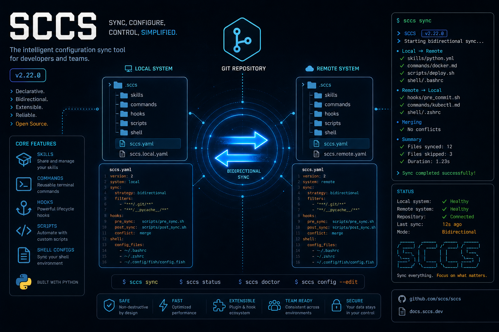

# SCCS — SkillsCommandsConfigsSync



> **Language / Sprache**: [Deutsch](#deutsche-dokumentation) | [English](#english-documentation)

**Version:** 2.48.0 · **Lizenz / License:** AGPL-3.0 · **Python:** ≥ 3.10

---

## Deutsche Dokumentation

### Was ist SCCS?

SCCS ist ein YAML-konfiguriertes, bidirektionales Synchronisierungswerkzeug für Claude Code Dateien (Skills, Commands, Hooks, Agents, Scripts) und optionale Shell-Konfigurationen (Fish, Starship, PowerShell). Es hält deine `~/.claude/`-Installation und ein Git-Repository deckungsgleich — über mehrere Maschinen, mehrere Plattformen, mehrere Identitäten hinweg.

### Was kann SCCS?

- 🔄 **Bidirektionale Synchronisierung** zwischen `~/.claude/` und Git-Repository, mit interaktiver Konfliktauflösung und automatischen Backups → [docs/usage/sync.md](docs/usage/sync.md)
- 🩺 **System & Plugin Health-Check** (`sccs doctor`) für Node.js, `claude` CLI, Claude-Plugins, npm-Helper-Tools, Browser-Bundles und Filesystem-Permissions — mit gezielten Reparatur-Plänen → [docs/usage/doctor.md](docs/usage/doctor.md)
- 🧹 **`sccs doctor optimize`** *(v2.30.0)* — Ein-Schuss-Optimierungslauf: install + update + Drift-Warnung für Plugins/MCP-Server außerhalb der Spec. Mit `--strict` werden Uninstall-Actions per Confirm gequeut.
- 🔧 **`doctor.disallowed_hooks`** *(v2.31.0)* — Substring-Patterns entfernen unerwünschte Hooks aus `~/.claude/settings.json` nach jedem doctor-Pass (z.B. Hooks die von npx-Tools re-injiziert werden). Mit Backup, idempotent.
- 🛡️ **`doctor.protected_hooks`** *(v2.32.0)* — harter Schutzwall (Default `gsd-`): geschützte Hooks werden NIE entfernt, auch wenn ein `disallowed_hooks`-Pattern matcht (*protection wins*). GSD-Hooks überleben jeden doctor-Pass.
- ⚡ **Auto-Update sicherer Wartung** *(v2.32.0)* — `sccs doctor update`/`optimize` führt Plugin-Install/Update, npx-Refresh (inkl. GSD), Marketplace- und Bundled-Skill-Schritte ohne Nachfrage aus; destruktive Actions (Uninstall, Hook-Removal) bleiben confirm-pflichtig.
- 📦 **Selektiver Export/Import** als ZIP-Archiv (Checkbox-Auswahl) für Kundendeployments → [docs/usage/transfer.md](docs/usage/transfer.md)
- 🧠 **Memory Bridge** — file-basierter persistenter Kontext zwischen Claude Code (Terminal) und Claude.ai (Web), inklusive `sccs memory` CRUD-CLI → [docs/usage/memory-bridge.md](docs/usage/memory-bridge.md)
- 🔀 **OpenCode-Integration** *(v2.37.0)* — `sccs integrations opencode` exportiert Claude-Artefakte one-way nach [OpenCode](https://opencode.ai): Skills/Rules werden nativ gelesen, Agents/Commands per Frontmatter-Konvertierung materialisiert, MCP-Server in `opencode.json` gemerged → [docs/usage/opencode.md](docs/usage/opencode.md)
- 🎯 **Dynamische Modell-Zuordnung** *(v2.38.0)* — `opencode map-models` löst Claude-Modelle gegen die real verfügbaren OpenCode-Modelle auf (`opencode models`-Discovery + Familien-Match), konfigurierbar über `opencode.model_map`, statischer Fallback offline → [docs/usage/opencode.md](docs/usage/opencode.md)
- 🚫 **OpenCode-Export ohne Plugin-Müll** *(v2.39.0)* — `opencode status`/`export-agents`/`export-commands` schließen doctor-gemanagte Artefakte (`gsd-*`, `playwright-cli` — dasselbe Registry wie der Sync) per Default aus; eigene Agents/Commands bleiben. Eigene Patterns via `opencode.exclude`, explizites `-a`/`-c` umgeht den Exclude → [docs/usage/opencode.md](docs/usage/opencode.md)
- 🧹 **GSD-Umzug + Orphan-Cleanup** *(v2.40.0)* — Doctor folgt GSD von `@opengsd/get-shit-done-redux` (deprecated) auf `@opengsd/gsd-core` und räumt verwaiste `gsd-*`-Skills/Agents auf: `doctor check` meldet sie, `doctor update` **verschiebt** sie (kein Hard-Delete, confirm-gated) nach `~/.config/sccs/gsd-orphans-backup-<ts>/`. Node-Mindestversion 22 → [docs/usage/doctor.md](docs/usage/doctor.md)
- 🥧 **Pi-Integration** *(v2.41.0)* — `sccs integrations pi` exportiert Claude-Artefakte one-way nach [Pi](https://pi.dev): Skills (Verzeichnis-Kopie) und Agents (als Einzel-Skills) → `~/.pi/agent/skills/`, Commands → `~/.pi/agent/prompts/`. Format-identisch zu Claude Code, daher verbatim kopiert (keine Konvertierung, kein Modell-Mapping); `gsd-*` per Default ausgeschlossen → [docs/usage/pi.md](docs/usage/pi.md)
- 🔎 **Doctor Update-Check** *(v2.42.0)* — `sccs doctor check` prüft jetzt live, ob für die verwalteten npx-Tools (`npm view`) und Plugins (Marketplace-Manifest) eine neuere Version verfügbar ist, und zeigt sie als `OUTDATED` + Hinweiszeile. Nur ein Hinweis, **kein** Exit 1 (CI-freundlich); `--no-update-check` für offline/schnell → [docs/usage/doctor.md](docs/usage/doctor.md)
- 🧰 **Optionale CLI-Tools im Doctor** *(v2.43.0)* — opt-in `doctor.cli_tools: [zoxide, coreutils]`: erkennt zoxide (alle Plattformen) und Microsoft Coreutils (nur Windows, native Unix-Tools in PowerShell) und hilft bei der Installation via `winget`/`brew`. `winget list` fängt die WinGet-Links-PATH-Falle ab (PowerShell-PATH-Block); nur Hinweis, **kein** Exit 1. Plus: `doctor check` zeigt den Node-Install-Befehl inline; Windows-UTF-8-Crash gefixt → [docs/usage/doctor.md](docs/usage/doctor.md)
- 🪟 **Windows-Doctor-Fixes** *(v2.43.1/2.43.2)* — `npm`/`npx` (`.cmd`-Wrapper) laufen jetzt über `cmd.exe /c`, sodass `doctor install` funktioniert; `path: npm-prefix-bin` zeigt nicht mehr fälschlich MISSING (npm-Global-Bin == Prefix, kein `\bin`); der PATH-Fix-Block ist unter Windows echtes PowerShell statt bash/fish → [docs/usage/doctor.md](docs/usage/doctor.md)
- 🤫 **New-Category-Prompt opt-in** *(v2.44.0)* — `sccs sync` schlägt neue Default-Kategorien (OpenCode, Pi) **nicht** mehr automatisch vor; der Prompt kommt nur noch mit `sccs sync --migrate` oder weiterhin via `sccs config upgrade`. Default-`sync` ist still — kein Prompt, keine Notice (auch in CI). `--no-migrate` bleibt als No-op gültig → [docs/usage/sync.md](docs/usage/sync.md)
- 🐚 **PowerShell-Komfort + pwsh-7-Check** *(v2.45.0)* — `sccs convert fish-to-pwsh` legt jetzt `conf.d/95-conveniences.ps1` mit gewohnten Fish-Shortcuts an (`ll`/`la`/`l` mit eza/lsd-Fallback, `..`/`...`/`....`, `which`/`touch`/`mkcd`); lädt zuletzt und gewinnt über die auto-konvertierten `ls`/`ll` (opt-out via `--no-conveniences`). Zusätzlich prüft `sccs doctor check` unter Windows, ob PowerShell 7+ installiert/aktuell ist, und schlägt sonst `winget install/upgrade --id Microsoft.PowerShell` vor (nur Hinweis, kein Auto-Install) → [docs/usage/platforms.md](docs/usage/platforms.md) · [docs/usage/doctor.md](docs/usage/doctor.md)
- 🪟 **Plattformübergreifend** macOS, Linux, Windows mit nativer PowerShell-7-Unterstützung und Fish→PowerShell-Konvertierung → [docs/usage/platforms.md](docs/usage/platforms.md)
- 🗂️ **Mehr als 30 vordefinierte Kategorien** mit Plattform-Filtern, anpassbaren Include/Exclude-Patterns und Sync-Modi → [docs/usage/categories.md](docs/usage/categories.md)

### Voraussetzungen

[UV](https://docs.astral.sh/uv/) muss installiert sein:

| Betriebssystem | Befehl |
|----------------|--------|
| macOS | `brew install uv` |
| Linux / WSL | `curl -LsSf https://astral.sh/uv/install.sh \| sh` |
| Windows | `powershell -ExecutionPolicy ByPass -c "irm https://astral.sh/uv/install.ps1 \| iex"` |

### Installation

```bash
# Als CLI-Tool installieren (empfohlen)
uv tool install sccs

# Aktualisieren
uv tool upgrade sccs
```

**Für Entwickler:**

```bash
git clone https://github.com/equitania/sccs.git
cd sccs
uv venv --python 3.13 && source .venv/bin/activate
uv pip install -e ".[dev]"
sccs --help
```

### Quick Start

```bash
sccs config init                 # Konfiguration erstellen
sccs status                      # Status anzeigen
sccs sync --dry-run              # Vorschau der Änderungen
sccs sync                        # Synchronisieren
sccs doctor check                # System & Plugin Health prüfen
```

### Dokumentation

| Datei | Inhalt |
|-------|--------|
| [docs/usage/sync.md](docs/usage/sync.md) | Sync-Workflow, Schnellstart, Konfiguration, Konfliktauflösung, Backups |
| [docs/usage/doctor.md](docs/usage/doctor.md) | `sccs doctor` — System & Plugin Health, Bundled Skills, Browser-Bundles, Permission-Checks |
| [docs/usage/transfer.md](docs/usage/transfer.md) | Export/Import als ZIP-Archive (Customer Deployment) |
| [docs/usage/memory-bridge.md](docs/usage/memory-bridge.md) | Memory Bridge: persistenter Kontext zwischen Claude Code und Claude.ai |
| [docs/usage/categories.md](docs/usage/categories.md) | Kategorien-Referenz, Standard-Kategorien, Plattform-Filter |
| [docs/usage/opencode.md](docs/usage/opencode.md) | OpenCode-Integration: Agents/Commands exportieren, Modell-Mapping, MCP-Merge |
| [docs/usage/pi.md](docs/usage/pi.md) | Pi-Integration: Skills/Agents/Commands nach Pi (pi.dev) exportieren |
| [docs/usage/platforms.md](docs/usage/platforms.md) | Windows/PowerShell-Support, Fish→PowerShell-Konvertierung |
| [docs/usage/cli-reference.md](docs/usage/cli-reference.md) | Vollständige CLI-Befehlsreferenz |
| [docs/architecture.md](docs/architecture.md) | Modul-Layout, Test-Setup, Quality-Gate |
| [RELEASE_NOTES.md](RELEASE_NOTES.md) | Versions-Historie und Changelog |

### Lizenz

AGPL-3.0 — Equitania Software GmbH

---

## English Documentation

### What is SCCS?

SCCS is a YAML-configured, bidirectional synchronization tool for Claude Code files (skills, commands, hooks, agents, scripts) and optional shell configurations (Fish, Starship, PowerShell). It keeps your `~/.claude/` installation and a Git repository in lockstep — across multiple machines, multiple platforms, multiple identities.

### What can SCCS do?

- 🔄 **Bidirectional sync** between `~/.claude/` and a Git repository, with interactive conflict resolution and automatic backups → [docs/usage/sync.md](docs/usage/sync.md)
- 🩺 **System & plugin health check** (`sccs doctor`) for Node.js, the `claude` CLI, Claude plugins, npm helper tools, browser bundles and filesystem permissions — with surgical repair plans → [docs/usage/doctor.md](docs/usage/doctor.md)
- 🧹 **`sccs doctor optimize`** *(v2.30.0)* — one-shot optimisation pass: install + update + drift warning for plugins/MCP servers outside the spec. With `--strict`, uninstall actions are queued per confirm.
- 🔧 **`doctor.disallowed_hooks`** *(v2.31.0)* — substring patterns strip unwanted hooks from `~/.claude/settings.json` after every doctor pass (e.g. hooks re-injected by npx tools). Backup-aware, idempotent.
- 🛡️ **`doctor.protected_hooks`** *(v2.32.0)* — hard guard (default `gsd-`): protected hooks are NEVER stripped, even when a `disallowed_hooks` pattern matches (*protection wins*). GSD hooks survive every doctor pass.
- ⚡ **Auto-update for safe maintenance** *(v2.32.0)* — `sccs doctor update`/`optimize` runs plugin install/update, npx refresh (incl. GSD), marketplace and bundled-skill steps without prompts; destructive actions (uninstall, hook removal) keep their confirm gate.
- 📦 **Selective export/import** as ZIP archives (checkbox selection) for customer deployments → [docs/usage/transfer.md](docs/usage/transfer.md)
- 🧠 **Memory Bridge** — file-based persistent context between Claude Code (terminal) and Claude.ai (web), including a full `sccs memory` CRUD CLI → [docs/usage/memory-bridge.md](docs/usage/memory-bridge.md)
- 🔀 **OpenCode integration** *(v2.37.0)* — `sccs integrations opencode` exports Claude artefacts one-way to [OpenCode](https://opencode.ai): skills/rules are read natively, agents/commands are materialised via frontmatter conversion, MCP servers are merged into `opencode.json` → [docs/usage/opencode.md](docs/usage/opencode.md)
- 🎯 **Dynamic model mapping** *(v2.38.0)* — `opencode map-models` resolves Claude models against the models your OpenCode install actually offers (`opencode models` discovery + family match), configurable via `opencode.model_map`, with a static fallback when offline → [docs/usage/opencode.md](docs/usage/opencode.md)
- 🚫 **OpenCode export skips plugin clutter** *(v2.39.0)* — `opencode status`/`export-agents`/`export-commands` exclude doctor-managed artefacts (`gsd-*`, `playwright-cli` — the same registry the sync engine honours) by default; your own agents/commands stay. Add your own patterns via `opencode.exclude`; an explicit `-a`/`-c` selection bypasses the exclude → [docs/usage/opencode.md](docs/usage/opencode.md)
- 🧹 **GSD move + orphan cleanup** *(v2.40.0)* — Doctor follows GSD from `@opengsd/get-shit-done-redux` (deprecated) to `@opengsd/gsd-core` and cleans up orphaned `gsd-*` skills/agents: `doctor check` reports them, `doctor update` **moves** them (no hard-delete, confirm-gated) to `~/.config/sccs/gsd-orphans-backup-<ts>/`. Minimum Node version is now 22 → [docs/usage/doctor.md](docs/usage/doctor.md)
- 🥧 **Pi integration** *(v2.41.0)* — `sccs integrations pi` exports Claude artefacts one-way to [Pi](https://pi.dev): skills (directory copy) and agents (as individual skills) → `~/.pi/agent/skills/`, commands → `~/.pi/agent/prompts/`. Format-identical to Claude Code, so copied verbatim (no conversion, no model mapping); `gsd-*` excluded by default → [docs/usage/pi.md](docs/usage/pi.md)
- 🔎 **Doctor update check** *(v2.42.0)* — `sccs doctor check` now checks live whether a newer version of the managed npx tools (`npm view`) and plugins (marketplace manifest) is available and shows it as `OUTDATED` + a hint line. Informational only, **no** exit 1 (CI-friendly); `--no-update-check` for offline/fast → [docs/usage/doctor.md](docs/usage/doctor.md)
- 🧰 **Optional CLI tools in the doctor** *(v2.43.0)* — opt-in `doctor.cli_tools: [zoxide, coreutils]`: detects zoxide (all platforms) and Microsoft Coreutils (Windows-only, native UNIX tools in PowerShell) and helps install them via `winget`/`brew`. `winget list` catches the WinGet-Links PATH trap (PowerShell PATH block); informational only, **no** exit 1. Plus: `doctor check` shows the Node install command inline; Windows UTF-8 crash fixed → [docs/usage/doctor.md](docs/usage/doctor.md)
- 🪟 **Windows doctor fixes** *(v2.43.1/2.43.2)* — `npm`/`npx` (`.cmd` wrappers) now run via `cmd.exe /c`, so `doctor install` works; `path: npm-prefix-bin` no longer shows a false MISSING (npm global bin == prefix on Windows, no `\bin`); the PATH-fix block is real PowerShell on Windows instead of bash/fish → [docs/usage/doctor.md](docs/usage/doctor.md)
- 🤫 **New-category prompt is opt-in** *(v2.44.0)* — `sccs sync` no longer auto-offers new default categories (OpenCode, Pi); the prompt only appears with `sccs sync --migrate` or via the dedicated `sccs config upgrade`. A plain `sync` is silent — no prompt, no notice (CI-friendly too). `--no-migrate` stays valid as a no-op → [docs/usage/sync.md](docs/usage/sync.md)
- 🐚 **PowerShell comfort + pwsh 7 check** *(v2.45.0)* — `sccs convert fish-to-pwsh` now writes `conf.d/95-conveniences.ps1` with the Fish-style shortcuts you're used to (`ll`/`la`/`l` with an eza/lsd fallback, `..`/`...`/`....`, `which`/`touch`/`mkcd`); it loads last and wins over the auto-converted `ls`/`ll` (opt out with `--no-conveniences`). On Windows, `sccs doctor check` also verifies PowerShell 7+ is installed/current and otherwise suggests `winget install/upgrade --id Microsoft.PowerShell` (a suggestion only, never an auto-install) → [docs/usage/platforms.md](docs/usage/platforms.md) · [docs/usage/doctor.md](docs/usage/doctor.md)
- 🪟 **Cross-platform** macOS, Linux, Windows with native PowerShell 7 support and Fish→PowerShell conversion → [docs/usage/platforms.md](docs/usage/platforms.md)
- 🗂️ **Over 30 predefined categories** with platform filters, customizable include/exclude patterns and sync modes → [docs/usage/categories.md](docs/usage/categories.md)

### Prerequisites

[UV](https://docs.astral.sh/uv/) must be installed:

| OS | Command |
|----|---------|
| macOS | `brew install uv` |
| Linux / WSL | `curl -LsSf https://astral.sh/uv/install.sh \| sh` |
| Windows | `powershell -ExecutionPolicy ByPass -c "irm https://astral.sh/uv/install.ps1 \| iex"` |

### Installation

```bash
# Install as CLI tool (recommended)
uv tool install sccs

# Update
uv tool upgrade sccs
```

**For developers:**

```bash
git clone https://github.com/equitania/sccs.git
cd sccs
uv venv --python 3.13 && source .venv/bin/activate
uv pip install -e ".[dev]"
sccs --help
```

### Quick Start

```bash
sccs config init                 # Initialize configuration
sccs status                      # Show sync status
sccs sync --dry-run              # Preview changes
sccs sync                        # Synchronize
sccs doctor check                # System & plugin health check
```

### Documentation

| File | Content |
|------|---------|
| [docs/usage/sync.md](docs/usage/sync.md) | Sync workflow, quick start, configuration, conflict resolution, backups |
| [docs/usage/doctor.md](docs/usage/doctor.md) | `sccs doctor` — system & plugin health, bundled skills, browser bundles, permission checks |
| [docs/usage/transfer.md](docs/usage/transfer.md) | Export/Import as ZIP archives (customer deployment) |
| [docs/usage/memory-bridge.md](docs/usage/memory-bridge.md) | Memory Bridge: persistent context between Claude Code and Claude.ai |
| [docs/usage/categories.md](docs/usage/categories.md) | Category reference, default categories, platform filters |
| [docs/usage/opencode.md](docs/usage/opencode.md) | OpenCode integration: export agents/commands, model mapping, MCP merge |
| [docs/usage/pi.md](docs/usage/pi.md) | Pi integration: export skills/agents/commands to Pi (pi.dev) |
| [docs/usage/platforms.md](docs/usage/platforms.md) | Windows/PowerShell support, Fish→PowerShell conversion |
| [docs/usage/cli-reference.md](docs/usage/cli-reference.md) | Full CLI command reference |
| [docs/architecture.md](docs/architecture.md) | Module layout, test setup, quality gate |
| [RELEASE_NOTES.md](RELEASE_NOTES.md) | Version history and changelog |

### License

AGPL-3.0 — Equitania Software GmbH
